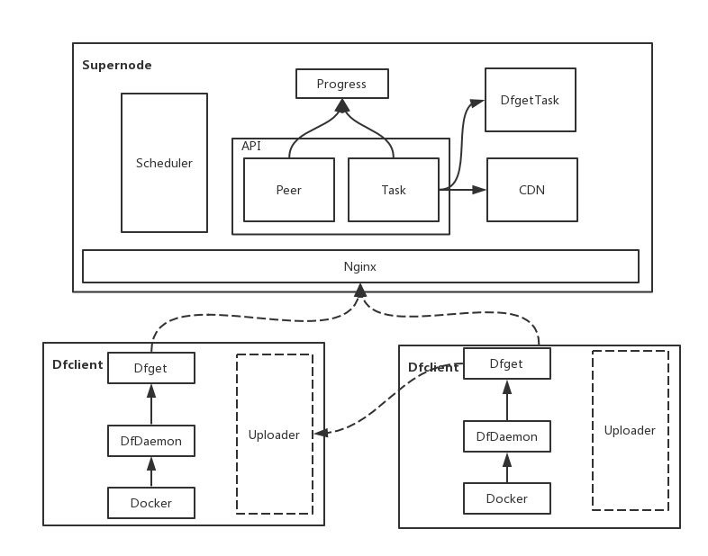
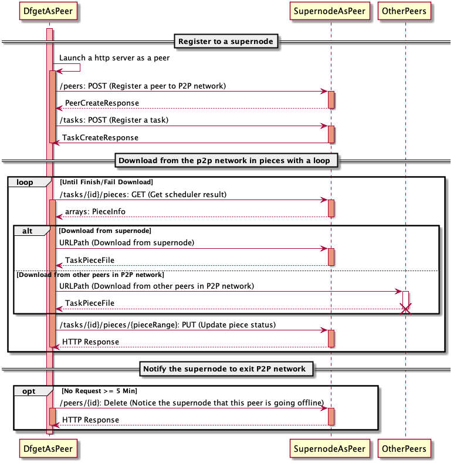
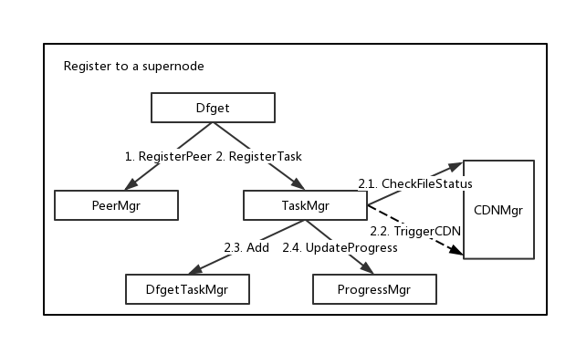
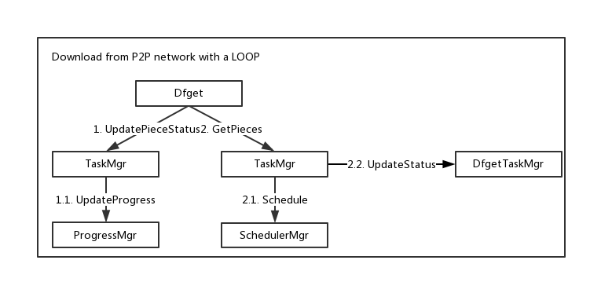
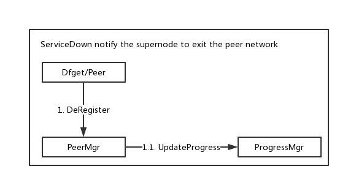

# Dragonfly Design Doc

## Contents

- [API Design](#api-design)
  - [Reference Docs](#reference-docs)
- [Architecture](#architecture)
- [Workflows](#workflows)
  - [Dfget and Supernode's communication workflows](#dfget-and-supernode's-communication-workflows)
  - [Supernode internal component workflows](#supernode-internal-component-workflows)

## Nouns/Phase Explanation

- **SuperNode**: SuperNode is a long-running process with two primary responsibilities:
  - It's the tracker and scheduler in the P2P network that choose appropriate downloading net-path for each peer.
  - It's also a CDN server that caches downloaded data from source to avoid downloading the same files from source repeatedly.
- **Dfget**: Dfget is the client of Dragonfly used for downloading files. It's similar to using wget. At the same time, it also plays the role of peer, which can transfer data between each other in p2p network.
- **Dfdaemon**: Dfdaemon establishes a proxy between container engine and registry, as a local long-running process. It filters out layer fetching requests from all requests send by container engine when pulling images, then it uses Dfget to download these layers.
- **P2P**: Peer-to-Peer, a distributed application architecture, more info refers to [wiki](https://en.wikipedia.org/wiki/Peer-to-peer).
- **Task**: A Task will store some meta info about the taskFile, pieces and something else.A Task has a one-to-one correspondence with a file on the disk which is identified by taskID. If you want to download a file from Supernode, you should register a task which means that tell the server about the file info you want to download before actually do it.
- **DfgetTask**: A DfgetTask represents a download process initiated by Dfget or other clients. When Dfget try to download a file from p2p network, Supernode will create a DfgetTask object for managing the lifecycle of download process.
- **Peer**: In a P2P network, peers are both suppliers and consumers of resources. So before Dfget begins a download task from Supernode, Dfget will launch a webserver that provides downloaded files service for other peers to download in the P2P network and send a `Peer/Register` request to Supernode to join the P2P network. Only after that can Dfget download files from P2P network.
- **Piece**: A piece is a part of the file that is going to be downloaded, which can be interpreted as a block of files. In dragonfly, the downloading file is not transmitted in a whole file, but in pieces.

## API Design

For a program, a well-designed API is very important, we design the APIs with principles in `RESTFUL` as follows:

- Keep each API's responsibilities simple.
- Provide APIs that cover the full process life cycle. Now we've just exposed the APIs required by the core process, and we'll add a more appropriate APIs as needed later.
- Use resources as the heart of the API, but they do not have to correspond to an actual data object one-by-one. `E.g.` Tasks are resources used by a client to operate, DfgetTasks are for internal implementation which should not be exposed to client.
- URLs should include nouns, not verbs. In additional, use plural nouns instead of singular nouns. `E.g.` `/peers/{id}: GET`.
- Use HTTP response status codes to represent the outcome of operations on resources. Please refer to [linker](https://github.com/dragonflyoss/Dragonfly/blob/master/apis/swagger.yml#L793).
- Avoid URL's path level is too deep, we try not to have URLs deeper than `resource/identifier/resource`, the deepest URL in our APIs is `/tasks/{id}/pieces/{pieceRange}` because of special circumstances.
- Well-documented, we organize the API with swagger and keep the API synchronized with the documentation through swagger generation tools.

### Reference Docs

API definition: [swagger.yml](https://github.com/dragonflyoss/Dragonfly/blob/master/apis/swagger.yml)

API document: [apis.md](https://github.com/dragonflyoss/Dragonfly/blob/master/docs/api_reference/apis.md)

## Architecture

In DragonFly, we have two roles:

- Supernode
- Dfclient, Dfclient contains two components:
  - Dfget
  - Dfdaemon

As mentioned above, we use the following picture to make it easier for you to understand.

## Workflows

### Dfget and Supernode's communication workflows

When Dfget try to download files/images from Supernode, there are three steps to follow:

1. Register to a Supernode
2. Download from the p2p network in pieces with a loop
3. ServiceDown

Below is a diagram illustrating that how Dfget download a file from Supernode.

#### Register to a Supernode

1. Dfget should launch a server as a peer and register to Supernode.
2. Dfget should tell the Supernode some info about files/images to be downloaded.

#### Download from the p2p network in pieces with a loop

The Dfget download is not a one-time work, it will download a piece at a time with a loop until the download is complete. It is mainly divided into the following three steps:

- Get peers information with the pieces to be downloaded.
- Download the pieces from the specified peers.
- Update the pieceInfo to tell Supernode that it has downloaded the piece for two things:
  - Provides a download service for other nodes in the network that need the piece
  - Get the information about other pieces that need to be downloaded

#### ServiceDown

When Dfget lasts in five minutes without downloading or uploading tasks, uploader of Dfget will automatically sends a serviceDown request to Supernode.

### Supernode internal component workflows

Based on the API and the function of the system, we have five modules so far as follows:

- TaskMgr: Manage the life cycle of tasks and pieces.
- PeerMgr: Manage the life cycle of peers includes registering/deregistering a peer and updating the status.
- DfgetTaskMgr: Manage the lifecycle of dfgetTasks.
- CDNMgr: Trigger CDN downloads and manage local cache files.
- ProgressMgr: Maintain the correspondence between peers and pieces.
- SchedulerMgr: Responsible for executing specific scheduling algorithms to get good scheduling results based on the info maintained by ProgressMgr.

We will show the Supernode internal component workflows by three workflows mentioned above.

Register to a Supernode

- Dfget should be registered as a peer node before it can download files from the P2P network.
- In `Dragonfly`, a file is uniquely identified by taskID and a download task is also scheduled according to taskID. So when Dfget needs to tell the Supernode the information about the file to be downloaded to get the taskID before actually starting to download the file.
  - Supernode will generate a specific taskID based on the information passed by `Dfget`, and check if the file corresponding to taskID exists locally which is managed by CDNMgr.
  - If in the previous check, the corresponding file is not found locally, it will trigger CDN to download the file asynchronously.
  - A download process corresponds to a`DfgetTask` object in the Supernode, so create a new object to track the progress of the download process.
  - Update the bitmap information for the P2P network.

Download from the p2p network in pieces with a loop

- Dfget should report the info and status of the piece downloaded when each success/fail to download a piece from the P2P network.
  - Supernode will update the bitmap information for the P2P network for better scheduling work.
- Dfget will not download the entire file at once but in pieces. So the Supernode will schedule several pieces of information each time for Dfget to download.
  - The scheduler will determine the next scheduling behavior according to certain scheduling rules.
  - Supernode will update the status of DfgetTask when success/fail to download some pieces or the entire download process ends in success/failure.

ServiceDown

- The peer uploader server started by Dfget will not always exist. If there is no new download request or download task for a long time (the default is 5 minutes), it will send a offline request to the supernode, shut down the server, and clean up the cache.
