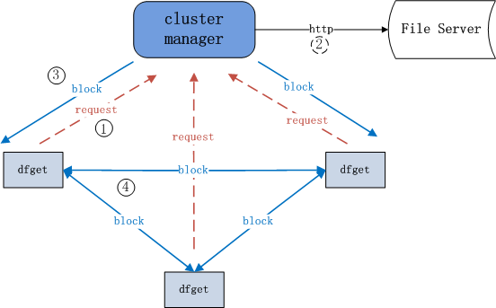
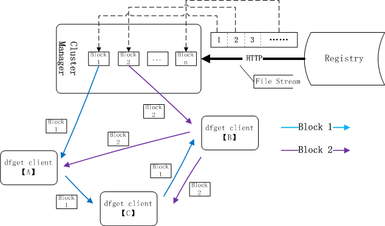

# Architecture Introduction

## Distributing General Files

 
The cluster manager is also called supernode, which is responsible for CDN and scheduling every peer to transfer blocks between them. dfget is the client of P2P, also called 'peer',which is mainly used to download and share blocks. 

## Distributing Container Images

 
Registry is similar to the file server above. dfget proxy is also called dfdaemon, which intercepts http-requests from docker pull or docker push,and then determines which requests need use dfget to handle.

## How file blocks are downloaded

Every File is divided into multiple blocks, which are transmitted between peers,one peer is one P2P client.
Cluster manager will judge whether the corresponding file exists in the local disk, if not, 
it will be downloaded into cluster manager from file server.
