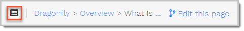
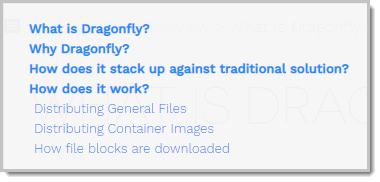
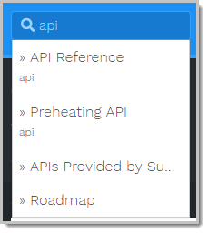

+++
title = "Before Starting"
weight = 1
pre = "<b>0. </b>"
+++

Before getting started, let's take a quick look at how to use this documentation portal of Dragonfly.

## Navigating

With a rich set of navigation features, you can always locate your target resource at ease.

### Navigating to the Homepage

To go to the homepage of the Dragonfly documentation portal, do one of the following:

- In the breadcrumb of any page, click Dragonfly.
- In the address bar of the browser, type `https://alibaba.github.io/Dragonfly/` and press Enter.

### Navigating to a Topic

To navigate to a topic, do one of the following:

- In the left-side navigation pane, click a chapter title to expand this chapter, and then click a child topic.
- In the left-side navigation pane, click a chapter title, and then on the right-side reading pane, click the child topic link.

### Navigating to a Specific Section of a Topic

Some topics can be lengthy. To jump to a specific section, do the following:

1. Hover-over the mini TOC icon in the breadcrumb.

    
2. In the mini TOC overlay, click a section heading.

    

### Navigating to Other Related Resources

To navigate to other related resources, such as the Dragonfly roadmap, github repo, contributing guide, and so on, click the link under More in the left-side navigation pane.

## Searching

Given that the Dragonfly documentation portal is a static website, you can find target information in a blink of an eye.

To perform a search, type your key words in the search box on the top of the left-side navigation pane, and matching results will appear in the overlay.

In the search results, click any link to jump to the topic, and your key words will be highlighted in yellow.

## Improving the Documentation

If you see a typo, or just feel like adding your insights, don't hesitate to click the Edit this page link in the breadcrumb. Then you'll be prompted to sign in your Github account and fork the repository.

For instructions on how to contribute to the documentation, see [Contributing Guide]().