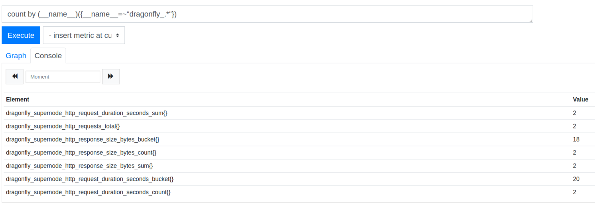

# Monitor Dragonfly with Prometheus

Currently metrics become an important part of observability. As for monitoring Dragonfly, we recommend you to use Prometheus.

In Dragonfly project, there are two long-running processes: supernode and dfdaemon. Each of the components expose its metrics via `/metrics` endpoint, so Prometheus can get metrics from each component. We will also support dfget metrics in the future. As for current metrics, you can check out [metrics](metrics.md).

## How to set up Prometheus

### Setup Dragonfly Environment

First, please ensure you know how to setup Dragonfly environment. If you don't, you can check out this  [quick_start](https://github.com/dragonflyoss/Dragonfly/blob/master/docs/quick_start/README.md) docs first. Besides, building from source code is ok.

``` bash
make build
# start supernode and dfdaemon
bin/linux_amd64/supernode
bin/linux_amd64/dfdaemon
```

When supernode and dfdaemon is running normally, you can check metrics through command line.

check dfdaemon metrics:

``` bash
➜  ~ curl localhost:65001/metrics
# HELP go_gc_duration_seconds A summary of the GC invocation durations.
# TYPE go_gc_duration_seconds summary
go_gc_duration_seconds{quantile="0"} 0
go_gc_duration_seconds{quantile="0.25"} 0
go_gc_duration_seconds{quantile="0.5"} 0
go_gc_duration_seconds{quantile="0.75"} 0
go_gc_duration_seconds{quantile="1"} 0
go_gc_duration_seconds_sum 0
go_gc_duration_seconds_count 0
# HELP go_goroutines Number of goroutines that currently exist.
# TYPE go_goroutines gauge
go_goroutines 10
```

check supernode metrics:

``` bash
➜  ~ curl localhost:8002/metrics
# HELP go_gc_duration_seconds A summary of the GC invocation durations.
# TYPE go_gc_duration_seconds summary
go_gc_duration_seconds{quantile="0"} 2.2854e-05
go_gc_duration_seconds{quantile="0.25"} 0.000150952
go_gc_duration_seconds{quantile="0.5"} 0.000155267
go_gc_duration_seconds{quantile="0.75"} 0.000171251
go_gc_duration_seconds{quantile="1"} 0.00018524
go_gc_duration_seconds_sum 0.000685564
go_gc_duration_seconds_count 5
# HELP go_goroutines Number of goroutines that currently exist.
# TYPE go_goroutines gauge
go_goroutines 8
```

If you can get the results above, it means your Dragonfly components work well. Next, we will start to setup Prometheus.

### Download Prometheus

[Download the release of Prometheus](https://prometheus.io/download/) for your platform, then extract and run it. Here we take Linux version as an example:

``` bash
wget https://github.com/prometheus/prometheus/releases/download/v2.11.1/prometheus-2.11.1.linux-amd64.tar.gz
tar -xvf prometheus-2.11.1.linux-amd64.tar.gz
cd prometheus-2.11.1.linux-amd64
```

Before starting using Prometheus, we should configure Prometheus first.

### Configure Prometheus

Here we provide a minimal-configuration below for monitoring Dragonfly. As for more detailed configuration, you can check [Prometheus Configuration](https://prometheus.io/docs/prometheus/latest/configuration/configuration/) for help.

```
global:
  scrape_interval:     15s # Set the scrape interval to every 15 seconds. Default is every 1 minute.

alerting:
  alertmanagers:
    - static_configs:
        - targets:
          # - alertmanager:9093

rule_files:
# - "first_rules.yml"
# - "second_rules.yml"

scrape_configs:
  - job_name: 'dragonfly'
    static_configs:
      - targets: ['localhost:8002', 'localhost:65001']
```

If you are not familiar with Prometheus, you can modify `prometheus.yml` to this configuration above. We add `localhost:8002` and `localhost:65001` to targets as an example, it represents the ip address of supernode and dfdaemon, which is accessible by Prometheus server. Most of the cases you may have to change to other ip address rather than using `localhost` because these components run in different machines or in docker containers.

Here we don't use any alert rules and alertmanager, so these parts is unset. After modifying this file, you can validate it via `promtool`.

``` bash
./promtool check config prometheus.yml
Checking prometheus.yml
  SUCCESS: 0 rule files found
```

Finally you can start Prometheus in the same directory. If Prometheus works well, you can open your browser with localhost:9090 and see Prometheus web ui.

``` bash
./prometheus
```

### Get Dragonfly Metrics Using Prometheus

In Prometheus web ui, you can search Dragonfly metrics below. If you want to learn more about Prometheus query language, please check [promql](https://prometheus.io/docs/prometheus/latest/querying/basics/) for help.



### Add your own metrics

Sometimes maybe you want to add your own metrics to Dragonfly. First please ensure you know the basic concepts about Prometheus metrics. If you don't, please check [metrics types](https://prometheus.io/docs/concepts/metric_types/).

We provide several functions to add metrics easily. Here is an example to add a Counter type metric.

``` go
import "github.com/dragonflyoss/Dragonfly/pkg/util"

requestCounter := util.NewCounter("supernode", "http_requests_total",
			"Counter of HTTP requests.", []string{"code"}, nil)
requestCounter.WithLabelValues("200").Inc()
```

This function will auto-register metrics to Prometheus default registry and you can get `dragonfly_supernode_http_requests_total{code,handler,method}` in /metrics endpoint. Here we also add prefix `dragonfly` to metrics name by default. If you want to learn more about how to use these metrics after getting them, please check [prometheus/client_golang](https://github.com/prometheus/client_golang).

As for naming of metric and label, it is better to follow the best practice. We suggest you to check this [metric and label naming](https://prometheus.io/docs/practices/naming/) guide for more detailed information.

### Integrating with other exporters

In order to monitor the over-all status of Dragonfly components, you may need to use other exporters. Prometheus itself has a huge ecosystem, including all kinds of exporters with different utilities. You can check [exporters](https://prometheus.io/docs/instrumenting/exporters/) for more information.

If you want to monitor the io status and network traffic of supernodes, we recommend you to use [node_exporter](https://github.com/prometheus/node_exporter).

### Use Grafana Dashboard

With metrics exposed in supernode, we can view these metrics in Grafana dashboards now by configuring [Prometheus Data Source](https://grafana.com/docs/features/datasources/prometheus/) first.

Example screenshots:


You can also import this [dragonfly dashboard](./dragonfly.json) into Grafana or just import it from [Grafana Dashboards](https://grafana.com/grafana/dashboards/10852).
