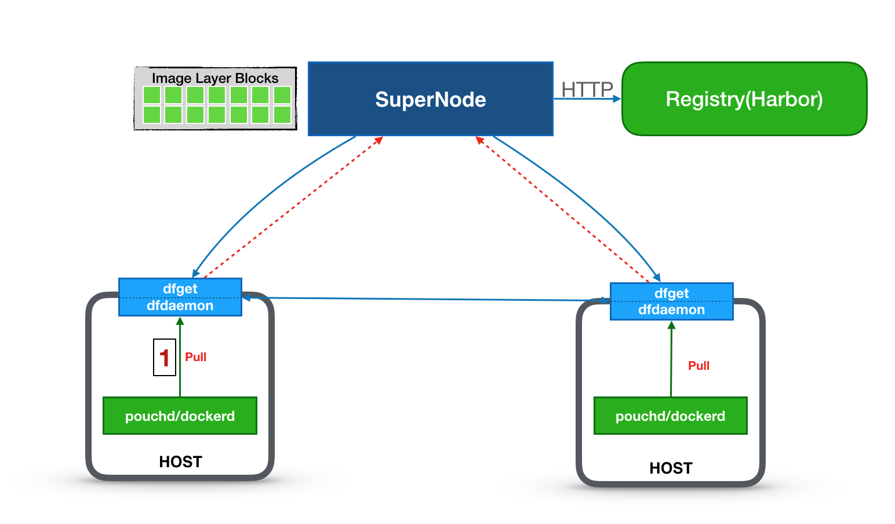

# Dragonfly multi-machines deployment

The multi-machines deployment documentation is designed to help you fully experience Dragonfly on multiple machines.

If you are using Dragonfly in your production environment to handle production image distribution, please refer to supernode and dfget's detailed production parameter configuration.

## Prerequisites

Assuming that experiment requires us to prepare three host machines, one to play a role of supernode, and the other two for dfclient. Then the topology of the three nodes cluster is like the following:



Then, we must provide:

1. three host nodes in a LAN, and we assume that 3 machine IPs are replaced by the following names.

    - **dfsupernode**: Dragonfly server
    - **dfclient0**: Dragonfly client one
    - **dfclient1**: Dragonfly client two

2. every node has deployed docker daemon

## Step 1: Deploy Dragonfly Server (SuperNode)

Deploy the Dragonfly server (Supernode) on the machine `dfsupernode`.

```bash
docker run -d --name supernode \
  --restart=always \
  -p 8001:8001 \
  -p 8002:8002 \
  -v /home/admin/supernode:/home/admin/supernode \
  dragonflyoss/supernode:1.0.2 --download-port=8001
```

## Step 2: Deploy Dragonfly Client (dfclient)

The following operations should be performed both on the client machine `dfclient0`, `dfclient1`.

### Prepare the configuration file

Dragonfly's configuration file is located in the `/etc/dragonfly` directory by default. When using the container to deploy the client, you need to mount the configuration file to the container.

Configure the Dragonfly Supernode address for the client:

```bash
cat <<EOD > /etc/dragonfly/dfget.yml
nodes:
    - dfsupernode
EOD
```

### Start Dragonfly Client

```bash
docker run -d --name dfclient \
    --restart=always \
    -p 65001:65001 \
    -v /etc/dragonfly:/etc/dragonfly \
    -v $HOME/.small-dragonfly:/root/.small-dragonfly \
    dragonflyoss/dfclient:1.0.2 --registry https://index.docker.io
```

**NOTE**: The `--registry` parameter specifies the mirrored image registry address, and `https://index.docker.io` is the address of official image registry, you can also set it to the others.

## Step 3. Configure Docker Daemon

We need to modify the Docker Daemon configuration to use the Dragonfly as a pull through registry both on the client machine `dfclient0`, `dfclient1`.

1. Add or update the configuration item `registry-mirrors` in the configuration file`/etc/docker/daemon.json`.

```json
{
  "registry-mirrors": ["http://127.0.0.1:65001"]
}
```

**Tip:** For more information on `/etc/docker/daemon.json`, see [Docker documentation](https://docs.docker.com/registry/recipes/mirror/#configure-the-cache).

2. Restart Docker Daemon.

```bash
systemctl restart docker
```

## Step 4: Pull images with Dragonfly

Through the above steps, we can start to validate if Dragonfly works as expected.

And you can pull the image as usual on either `dfclient0` or `dfclient1`, for example:

```bash
docker pull nginx:latest
```

## Step 5: Validate Dragonfly

You can execute the following command to check if the nginx image is distributed via Dragonfly.

```bash
docker exec dfclient grep 'downloading piece' /root/.small-dragonfly/logs/dfclient.log
```

If the output of command above has content like

```
2019-03-29 15:49:53.913 INFO sign:96027-1553845785.119 : downloading piece:{"taskID":"00a0503ea12457638ebbef5d0bfae51f9e8e0a0a349312c211f26f53beb93cdc","superNode":"127.0.0.1","dstCid":"127.0.0.1-95953-1553845720.488","range":"67108864-71303167","result":503,"status":701,"pieceSize":4194304,"pieceNum":16}
```

that means that the image download is done by Dragonfly.

If you need to ensure that if the image is transferred through other peer nodes, you can execute the following command:

```bash
docker exec dfclient grep 'downloading piece' /root/.small-dragonfly/logs/dfclient.log | grep -v cdnnode
```

If the above command does not output the result, the mirror does not complete the transmission through other peer nodes. Otherwise, the transmission is completed through other peer nodes.
