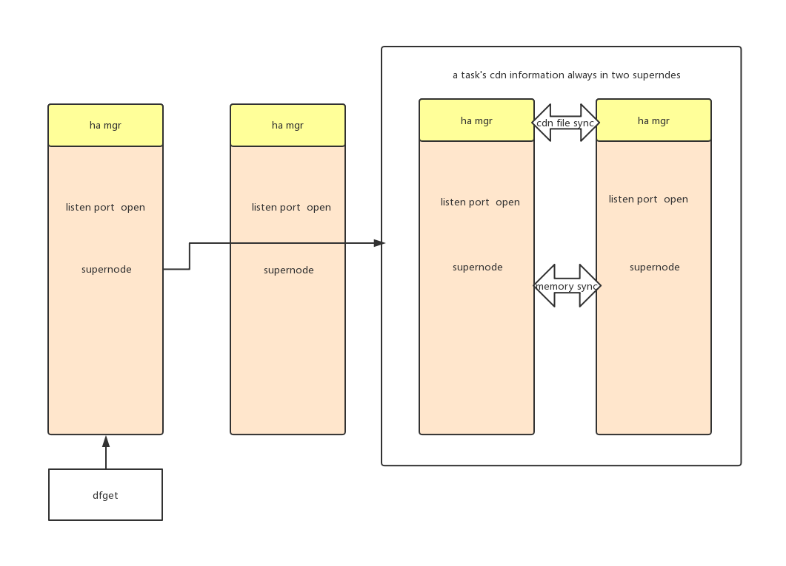

# Supernode High Availability

This doc contains all the design and usage document of supernode HA.

## Two Goals Need to be Achieved

To implement HA,we must guarantee the following two goals to be achieved:

- Compatible with current mode
- If a supernode is crash,other supernode can take over its work.In fact,supernode ha include two part,cdn file ha and memory information ha,In fact,this design only finishes cdn file ha.

## Tool Introduction

We can use distributed key-value store system such as etcd,zookeeper,consul and so on to manager the supernodes cluster.of course you can implement your own function to get supernodes information.
now we use etcd to store every superondoe's information include peerID,IP and so on.

Let’s focus on etcd because we will use it to construct our plan. etcd is a strongly consistent,distributed key-value store that provides a reliable way to store data that needs to
be accessed by a distributed system or cluster of machines. It gracefully handles leader elections during network partitions and can tolerate machine failure, even in the leader node.

### About Multi-Supernode Pattern

Now we talk about how to implement file ha.In Dragonfly,we now has a multi-supernode pattern.This pattern can be a replace of ha,but it has these disadvantages,

- Every supernode is stand-alone,so supernode can't communicate with each other for a better schedule.For example,pieces of a task are in different p2p network,so a supernode can only schedule its plan with its own peer instead of other peer which has pieces of a task in other p2p network.

- Every supernode will download the same file repeatedly,which makes download slowly and a waste of disk place.This will be obvious when the supernode's num is large.

## Cdn File HA Design

Below is a diagram illustrating that how to implement HA.



### The Logic Is as Follows

when dfget register a task and want to trigger a cdn download:

```
if (cdn success){
    if task.cdnPeerID==config.getSupernodePID{  //every task add cdnPeerID to mark which supernode the cdn file in
         return
    }else{
        send a dfget register copy to the supernode the cdnPeerID represents
    }
}else{
   for node:=range otherSupernode{
        if(the task in this node isn't failed){
            task.cdnPeerID=node.supernodePID
            send a dfget register copy to the supernode the cdnPeerID represents
                   if task.status==success{
                         update task info according other supernode task info and set
                    }else if  task.status==wait||running{
                         if (task in another supernode changes){
                              update task info
                         }
                   }
        }else{
            download itselef
            trigger an another superode to download randomly
        }

   }
}

```

pull task:

```
if task.cdnPeerID==supernode.PID{
     schedule by this supernode
}else{
       find the supernde information according task.cdnPeerID
       if find{
           get schedule from other supernode
           update progress and dfgetTask
       }
}
```

report piece

```
if task.cdnPeerID==supernode.PID{
     report piece as previous
}else{
       find the supernde information according task.cdnPeerID
       if find{
           report to other supernode
           set piece.dstPID=supernode.PID to look like this piece download from supernode itself and update progress
       }
}

```

server down

```

if task.cdnPeerID==supernode.PID{
     do with server down as previous
}else{
       find the supernde information according task.cdnPeerID
       if find{
           send server down to other supernode
           do with server down itself
       }
}
```

## Usage

We can use these cli commend to config supernode HA:

```
     --rpc-port int           if you use supernode HA,you should set the rpc port to implement ha (default 9000)
 -H, --use-ha                 set whether to use supernode HA
      --etcd-address strings   if you use supernode HA,you should set the etcd address to implement ha (default [127.0.0.1:2379])
```

we can use this commend to deploy a supernodes HA cluster:

```sh
  supernode --home-dir /home/admin/supernode1 --port=8002 --download-port=8001 --advertise-ip=127.0.0.1 -H  --rpc-port 8003  --etcd-address 127.0.0.1:2379
  supernode --home-dir /home/admin/supernode2 --port=8004 --download-port=8001 --advertise-ip=127.0.0.2 -H  --rpc-port 8005  --etcd-address 127.0.0.1:2379
  supernode --home-dir /home/admin/supernode3 --port=8006 --download-port=8001 --advertise-ip=127.0.0.3 -H  --rpc-port 8007  --etcd-address 127.0.0.1:2379
```